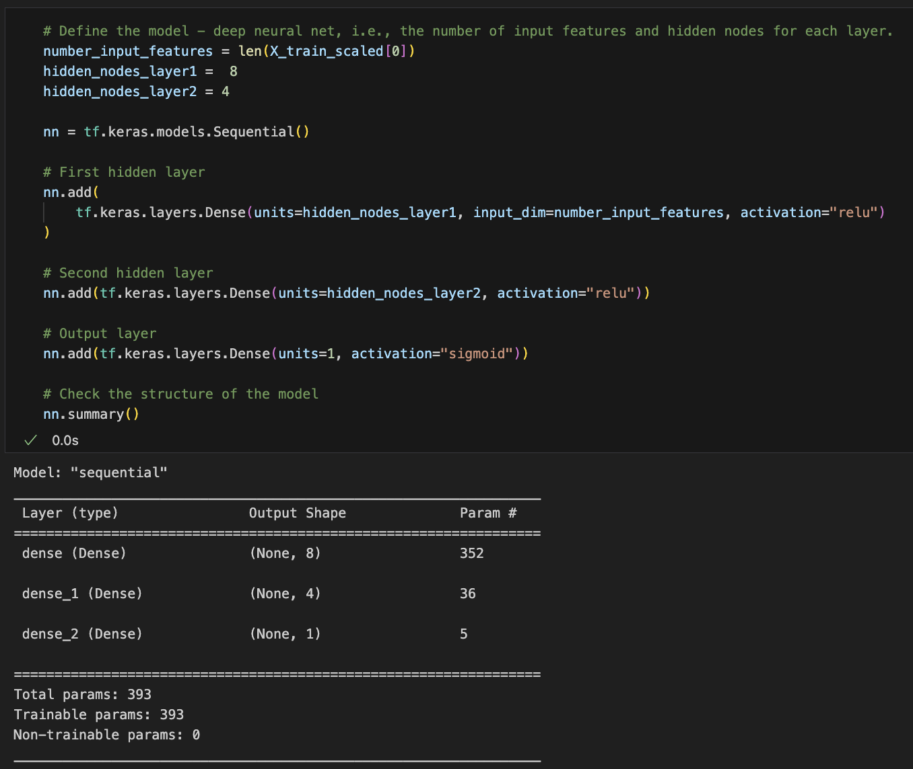

### Overview of the analysis: 
For this assignment, we build a deep learning/neural network model that can help us select potential applicants for funding with the best chance of success in their ventures. I have made three attempts to optimize my model to create this tool. The goal was to achieve an accuracy score of at least 75% to be confident of the performance of the model in predicting success rates in loan candidates. 

The optimization process involved a couple of layers of trial and error by adjusting our variables, dropping data that would skew our model, and also playing around with our neural network layers and activation functions. These steps have been outlined below.
---

### Results:

#### Data Preprocessing

1. What variable(s) are the target(s) for your model?

In all of my attempted models, our target variable or 'y variable' is the "IS_SUCCESSFUL" column in our given data. This is because we are trying to predict the success rate of a loan. This information allows us to train our model accordingly to see the accuracy of loan classification.

2. What variable(s) are the features of your model?

Our feature variables or 'X values' vary by model.

- Model 1: APPLICATION_TYPE, AFFILIATION, CLASSIFICATION, USE_CASE, ORGANIZATION, STATUS, INCOME_AMT, SPECIAL_CONSIDERATIONS and ASK_AMT
- Model 2: APPLICATION_TYPE, AFFILIATION, CLASSIFICATION, USE_CASE, ORGANIZATION, STATUS, INCOME_AMT and ASK_AMT
- Optimized Model: NAME, APPLICATION_TYPE, AFFILIATION, CLASSIFICATION, USE_CASE, ORGANIZATION, INCOME_AMT and ASK_AMT

3. What variable(s) should be removed from the input data because they are neither targets nor features?

The following variables were removed in each model

- Model 1: EIN, NAME
- Model 2: EIN, NAME, SPECIAL_CONSIDERATIONS
- Optimized Model: EIN, SPECIAL_CONSIDERATIONS, STATUS

#### Compiling, Training, and Evaluating the Model

1. How many neurons, layers, and activation functions did you select for your neural network model, and why?

For my first model, I used 2 hidden layers in addition to my input and output layers. For my first hidden layer, I used 8 neurons, and for the second hidden layer I used 4, bringing to a total of 12 neurons. As for my activation functions, both hidden layers use ReLU while my output layer uses a sigmoid function. While training the model, I added 100 epochs.

The number of layers and neurons can impact the network's capacity to learn patterns, and the choice of activation functions can affect how these patterns are modeled. The architecture should be selected based on experimentation and performance evaluation. Since this was my first attempt, it was good to use this for my neural network model to check the model's accuracy.

2. Were you able to achieve the target model performance?

The first and second attempts did not achieve target model performance while my third attempt did meet the suggested 75% accuracy score.

Model 1

Model 2

Optimized Model

3. What steps did you take to increase model performance?

For my second model, I tried removing the SPECIAL_CONSIDERATIONS column to see if that changed the accuracy score. I even added 3 hidden layers with 10, 8, and 6 neurons respectively. I used a ReLU activation function on the input layer and resigned to a sigmoid function for all other layers. These changes didn't change the accuracy substantially, but there was a minimal improvement. I even reduced the number of epochs to 30 after observing the first training model.

Finally, for the Optimized model, I decided to retain the NAME column and create bins for less frequently occurring loan applicants. In addition to the previous columns removed, I removed the STATUS column as well. The information derived from these columns did not add much to our predictions. I did not change the neural network pattern from my second attempt, and the model seemed to reach the target performance with an accuracy of 75%.

---

### Summary: 
Three deep learning models were developed to predict the success rate of loan applicants, with the optimized model meeting the target accuracy of 75%. The optimization process involved adjusting features, removing columns, and experimenting with neural network architecture. The final model retained the NAME column, used bins for infrequent applicants, and excluded the STATUS column, achieving the desired accuracy.

To potentially improve model performance further, consider exploring more complex neural network architectures, different activation functions, and hyperparameter tuning. Additionally, ensemble learning methods like random forests and gradient boosting could be tested. Extensive feature engineering and data preprocessing may reveal valuable insights, and alternative machine learning algorithms might be worth investigating to enhance classification accuracy.
